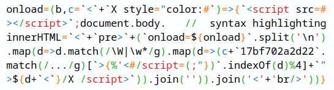

# how to write lots of quines

* [intro](#intro)
* [techniques](#techniques)
    * [syntax access](#syntax-access)
    * [string encoding](#string-encoding)
        * [more string encoding](#more-string-encoding)
    * [bytes](#bytes)
    * [eval](#eval)
* [additional fun](#additional-fun)
    * [expressions](#expressions)
    * [ascii art](#ascii-art)
    * [HTML](#html)
    * [hash](#hash)
    * [IRC bot](#irc-bot)
    * [rubiks cube](#rubiks-cube)
    * [error](#error)
    * [repeating](#repeating)
    * [cheating](#cheating)
    * [misc](#misc)
    * [links](#links)

## intro

A `quine` is a program that provides its own source code as output. It's one of the first programs I'll try and write when learning a new language, but it wasn't always obvious to me how. At first these cute programs seemed like an almost impossible esoteric [IOCCC](https://www.ioccc.org/)-tier artform crafted by programming artisans.

I want to share the general concepts used to construct programs like these and explore some of the things that can be done with them.

## techniques

Non-trivial[*](#cheating) quines nearly always use some form of transform between code and data, the most straightforward of which appear in languages that give access to string representations of the code. 

### syntax access

A quine in a simple language with a `getSource` function may look like

```
expr = print('expr = ' . getSource(expr))
```

We can access most of the source code already with this function by reading `expr`. However, we have to specify `'expr = '` again, because it falls outside the expression the source is coming from.

This string data is actually used twice in the output string! Once at the start of the output, and again as part of the source of the expression. This reuse of information is a common trick when writing quines.

JavaScript allows this kind of introspection for arbitrary functions by just converting them to strings:

```javascript
function quine() {
    console.log(String(quine) + '\nquine();');
}
quine();
```

This is very similar to our pseudocode example, except we use a function rather than a generic expression.

Now for the same example in python:

```python
import inspect
quine = lambda x: print('import inspect\n' + x + 'quine(inspect.getsource(quine))');
quine(inspect.getsource(quine))
```

More boilerplate is required to glimpse behind the curtain and grab the code, but it uses the exact same approach at the previous examples.

We'll find a shorter Python quine later.

While these quines are easy to make and understand, the functionality to achieve them isn't common to most programming languages. They're also a bit [dubious] When it's absent, we have to do something else.

### string encoding

A more general approach we can use is to have some blob of data, and use it in the output twice; once to represent itself, and again to represent the rest of the code. 

This is best demonstrated with strings.

```
data = ""; print('data = ' . data  . data)
```

Here is a template with no data. We print `data = `, the data itself, then the data again.

All we have to do is make the data contain everything that comes after it.

```
data = "; print('data = ' . data . data)"; print('data = ' . data . data)
```

But this isn't enough; we need to add quotes the first time we print the data, otherwise we get this output:

```
data = ; print('data = ' . data . data); print('data = ' . data . data)
```

Adding the quotes into the data string would require escaping them. 

This can be done, but alternatively we could call a function to add the quotes without using the quote characters themselves.

```
data = "; print('data = ' . addQuotes(data) . data)"; print('data = ' . addQuotes(data) . data)
```

This transform allows us to print the string in two different ways, and we have our quine!

Ruby provides a sort of debug view for a string that gives the same solution:

```ruby
data = "; print('data = ' + data.dump + data)"; print('data = ' + data.dump + data)
```

As does Python:

```python
data = "; print('data = ' + repr(data) + data)"; print('data = ' + repr(data) + data)
```

In JavaScript, we can use `JSON.stringify`

```javascript
data = "; console.log('data = ' + JSON.stringify(data) + data)"; console.log('data = ' + JSON.stringify(data) + data)
```

These quotes don't have to come from a quoting function. We can conjure them up from anywhere!

```javascript
data = "; console.log('data = ' + unescape('%22') + data + unescape('%22') + data)"; console.log('data = ' + unescape('%22') + data + unescape('%22') + data)
```

We are not tied to this template, and can add a transform to some of the data:

```javascript
data = "; console.log('data = %22' + data + '%22' + unescape(data))"; console.log('data = "' + data + '"' + unescape(data))
```

Now instead of printing the same data string twice verbatim, the second time we transform the escaped quotes back into quotes.

This transform allows us to represent additional things that dont appear in the original data string that we want to print.

#### more string encoding

Continuing with the data transform idea, we can also just encode the whole string. PHP has some built in base64 stuff we can use;

```php
<?php $data = ""; echo '<?php $data = "'.$data.'"' .base64_decode($data);
```

First we create our template with missing data as before, then we need to generate a base64 representation of our code;

```php
<?php echo base64_encode('; echo \'<?php $data = "\'.$data.\'"\' .base64_decode($data);');
```

We dont have to worry about quote escapes as the base64 representation will not contain any.

```php
<?php $data = "OyBlY2hvICc8P3BocCAkZGF0YSA9ICInLiRkYXRhLiciJyAuYmFzZTY0X2RlY29kZSgkZGF0YSk7"; echo '<?php $data = "'.$data.'"' .base64_decode($data);
```

The two representations of the data are very different to each other. We can use lots of different types of encoding for this. Say, hex digits in Python;

```python
d="3b7072696e742827643d22272b642b62797465732e66726f6d6865782864292e6465636f6465282929";print('d="'+d+bytes.fromhex(d).decode())
```

If a language doesnt have builtins for encoding, we can write our own.

Here's an example in Ruby where we just add 1 to the character code and subtract it when we want to format it;

```ruby
data = "#<!qsjou!(ebub!>!#(!,!ebub!,!ebub/dibst/nbq|}di})di/pse.2*/dis~/kpjo)*"; print 'data = "' + data + data.chars.map{|ch|(ch.ord-1).chr}.join()
```

Of course, you're not limited to just ASCII characters.

```javascript
data = "󘬊󨽯󫭳󫽬󩜮󫍯󩼨󙽤󨝴󨜠󟜠󘬧󘌫󘍤󨝴󨜠󚼠󭝮󩝳󨽡󬍥󚍥󬽣󨝰󩜨󩍡󭍡󚜮󬭥󬍬󨝣󩜨󛽵󛬮󛽧󛌧󘌧󚜩󚜻"
console.log('data = "' + data + unescape(escape(data).replace(/u../g,'')))
```

<sub>(You may have noticed the structure change to `data = ""; print('data = "' . data  . convert(data))` in the last few examples. Everything that comes after the data string can be encoded inside it, including the quote that follows it)</sub>


### bytes

Most of the examples so far have leaned on high level string methods, but the data can really be anything as long as there's a way to output it.

Take this C quine;

```C
#include <stdio.h>

int data[] = {125,59,10,10,105,110,116,32,109,97,105,110,40,41,32,123,10,32,32,112,114,105,110,116,102,40,34,35,105,110,99,108,117,100,101,32,60,115,116,100,105,111,46,104,62,92,110,92,110,105,110,116,32,100,97,116,97,91,93,32,61,32,123,34,41,59,10,32,32,10,32,32,102,111,114,32,40,105,110,116,32,105,32,61,32,48,59,32,100,97,116,97,91,105,93,59,41,32,123,10,32,32,32,32,112,114,105,110,116,102,40,34,37,100,34,44,32,100,97,116,97,91,105,93,41,59,10,32,32,32,32,105,102,32,40,100,97,116,97,91,43,43,105,93,41,32,112,114,105,110,116,102,40,34,44,34,41,59,10,32,32,125,10,10,32,32,102,111,114,32,40,105,110,116,32,105,32,61,32,48,59,32,100,97,116,97,91,105,93,59,41,32,123,10,32,32,32,32,112,114,105,110,116,102,40,34,37,99,34,44,32,100,97,116,97,91,105,43,43,93,41,59,10,32,32,125,10,125};

int main() {
  printf("#include <stdio.h>\n\nint data[] = {");
  
  for (int i = 0; data[i];) {
    printf("%d", data[i]);
    if (data[++i]) printf(",");
  }

  for (int i = 0; data[i];) {
    printf("%c", data[i++]);
  }
}
```

If you squint you may be able to see that this is very similar to our string encoding examples, except we're using bytes to represent character codes. We are still printing the data in two ways; to represent the collection of bytes, and to represent the code itself.

This is about as simple as we can get; just some bytes, loops, and printing. It should start to become clear how this idea can be applied to any language.

Using bytes was how I managed to eventually squeeze a quine out of an older version of vlang:

```vlang
m:=[32, 112, 114, 105, 110, 116, 40, 39, 109, 58, 61, 39, 43, 109, 46, 115, 116, 114, 40, 41, 41, 102, 111, 114, 32, 98, 32, 105, 110, 32, 109, 123, 112, 114, 105, 110, 116, 40, 115, 116, 114, 105, 110, 103, 40, 91, 98, 93, 41, 41, 125] 
print('m:='+m.str())for b in m{print(string([b]))}
```

<sub>(In C, you could imagine using `char[]` instead of `int[]` for the data and printing the string all at once without looping. In vlang, `string` seems to truncate to 1 character, even though it takes an array, so you end up with this `string([b])` loop thing)</sub>


---

A good example of this approach is [this quine in 8080 Assembly](https://rosettacode.org/wiki/Quine#8080_Assembly). If you look at the data at `P` label you can see the bytes are a representation of the instructions above it.

### eval

Languages with eval allow us to define our own code to be run from a string, so we already have a reference to a printable version of the code that is run and can skip having to do any introspection on it. 

```
data = "print('data = ' . addQuotes(data) . '; eval(' . data . ')')"; eval(data)
```

The data is now being passed to eval as code, and when that code executes it references the data again to print it in the output.

This style of quine tends be shorter or have less repetition, as it leans on eval to do most of the work.

In Ruby

```ruby
data="print('data='+data.dump+';eval(data)')";eval(data)
```

In Python

```python
data="print('data='+repr(data)+';eval(data)')";eval(data)
```

Lua has a `load` function that creates a function from a string that can be used in a similar way.

```lua
data="print(string.format('data=%q load(data)()',data))" load(data)()
```

In the Lua example, we can use `%q` to provide a quoted version of the data to the string formatter.

## additional fun

### expressions

So far we've created quines that are programs that produce output, but expressions can also be shown to exhibit quine-like behaviour.

These expression based quines can be run in a [REPL](https://en.wikipedia.org/wiki/Read%E2%80%93eval%E2%80%93print_loop). 

Instead of printing with `console.log` like before

```javascript
function quine() { console.log(String(quine) + ' quine();'); } quine();
```

We write an expression that evaluates to its own source

```javascript
(function quine() { return `(${quine})();` })();
```

Or more tersely

```javascript
(q=_=>`(q=${q})()`)()
```

---

If we really want to start creating crimes against programming we can use ` ``.link()[8] ` to create quotes

```javascript
eval(d="`eval(d=`+(e=``.link()[8])+d+e+`)`")
```

### ascii art

Starting with the terse expression style quine from before

```javascript
(q=_=>`(q=${q})()`)()
```

It's possible to modify any reflected segment and still remain a quine

```javascript
(q=_=>/* this is still a quine */`(q=${q})()`)()
```

Which makes generating an ASCII art quine trivial

```javascript
     q=u=>(`in     equinequ     inequinequinequinequinequi        nequinequinequinequinequinequi
   nequinequineq   uinequin     equinequinequinequinequineq       uinequinequinequinequinequineq
 uinequinequinequi nequineq     uinequinequinequinequinequin      equinequinequinequinequinequin
equinequinequinequinequineq     uinequinequinequinequine`,e='     q='+q+';q()',`uinequinequinequ
inequine   quinequi nequine     quinequ   inequi  nequinequine    quinequi  nequine       quineq
uinequi     nequine quinequ     inequin   equine  quinequinequi   nequineq  uinequi
nequine     quinequ inequin     equineq   uinequ  inequinequineq  uinequin  equinequinequineq
uinequi     nequine quinequ     inequin   equine  quinequi nequin equinequ  inequinequinequin
equineq     uinequi nequine     quinequ   inequi  nequineq  uinequinequine  quinequinequinequ
inequin     equineq uinequi     nequine   quineq  uinequin   equinequinequ  inequinequinequin
equineq  uinequineq uinequi     nequine   quineq  uinequin    equinequineq  uinequi
nequineq uinequineq uinequin   equinequ   inequi  nequineq     uinequinequ  inequin       equine
quinequinequinequin equinequinequinequi nequinequinequineq      uinequinequinequinequinequinequi
 nequinequinequine   quinequinequinequ  inequinequinequine       quinequinequinequinequinequineq
   uinequinequine      quinequinequi    nequinequinequineq        uinequinequinequinequinequineq
     uinequinequine      quinequin      equinequinequinequ         inequinequinequinequinequineq
             uineq`,
              e);q()
```

---

Another less trivial but more powerful trick is to store code in a string that you manipulate and eval later. This allows you to add whitespace anywhere in code you want to and strip it before execution.

```JavaScript
     eval(s      =`eval(
   s.slice(54  ,3e2).split
 (/\\s+/g).join(""))/*[b,S,n
,L]=String.fromCharCode(96,32
,10,92);'love is one of the m
ost wonderful emotions that w
 e experience';r='repeat';co
   nsole.log(S[r](5)+'eval
     (s'+S[r](6)+'='+b+s
       .replace(L,L+L)
         +b+n+S[r](1
           4)+')')
             */`
              )
```

---

You can do this without fancy string introspection too;

```rust
                                                      fn main(){let q:&[u8]=&[
                                                32,00,00,00,00,00,00,00,61,27,80,82,
                                       73,78,84,76,78,01,08,02,91,93,70,78,00,77,65,73,78,08,
                                 09,91,91,76,69,84,00,81,26,06,59,85,24,61,29,06,59,02,12,00,51,84,
                              82,73,78,71,26,26,70,82,79,77,63,85,84,70,24,08,86,69,67,01,59,66,07,00,
                           07,27,00,21,20,61,09,14,85,78,87,82,65,80,08,09,09,27,76,69,84,00,82,29,08,81,
                     14,76,69,78,08,09,65,83,00,70,22,20,15,83,84,68,26,26,70,22,20,32,00,00,00,00,00,00,00,00,
                  00,26,26,67,79,78,83,84,83,26,26,48,41,09,14,83,81,82,84,08,09,65,83,00,73,19,18,11,20,27,76,69,
                  84,00,77,85,84,00,66,26,00,54,69,67,28,08,73,19,18,12,00,73,19,18,09,00,30,29,00,54,69,67,26,26,
               78,69,87,08,09,27,00,15,10,00,00,00,79,79,69,82,00,00,10,15,00,76,69,84,00,77,85,84,00,88,29,82,13,17,
            27,00,76,69,84,00,77,85,84,00,89,29,16,27,32,00,00,00,00,00,00,00,00,00,00,76,69,84,00,77,85,84,00,75,29,17,
         27,76,69,84,00,77,85,84,00,74,29,17,27,76,69,84,00,77,85,84,00,69,29,75,00,13,08,82,28,28,17,09,27,87,72,73,76,69,
         00,88,30,29,89,91,66,14,80,85,83,72,08,08,82,11,88,12,82,11,89,09,09,27,66,14,80,85,83,72,08,08,82,11,89,12,82,11,
      88,09,09,27,00,66,14,80,85,83,72,08,08,82,13,89,12,82,11,88,09,32,00,00,00,00,00,00,00,00,00,00,00,00,00,09,27,66,14,80,
      85,83,72,08,08,82,13,88,12,00,82,11,89,09,09,27,66,14,80,85,83,72,08,08,82,13,88,12,82,13,89,09,09,27,66,14,80,85,83,72,
      08,08,82,13,89,12,82,13,88,09,09,27,00,66,14,80,85,83,72,08,08,82,11,89,12,82,13,88,09,09,27,66,14,80,85,83,72,08,08,82,
   11,88,12,82,13,89,09,09,27,00,73,70,00,69,28,29,16,91,32,00,00,00,00,00,00,00,00,00,00,00,00,00,00,00,00,89,11,29,17,27,69,11,
   29,74,27,74,11,29,18,27,93,73,70,00,69,30,16,00,91,88,13,29,17,27,75,11,29,18,27,69,11,29,75,13,08,82,28,28,17,09,27,93,93,76,
   69,84,00,77,85,84,00,84,29,81,14,73,84,69,82,08,09,27,07,79,26,70,79,82,00,89,00,73,78,00,17,14,14,82,10,18,00,91,00,76,69,84,
   00,76,26,00,54,69,67,32,00,00,00,00,00,00,00,00,00,00,00,00,00,00,00,00,00,00,00,28,73,19,18,30,00,29,00,66,14,73,84,69,82,08,
   09,14,70,73,76,84,69,82,08,92,88,92,00,88,14,17,29,29,89,09,14,77,65,80,08,92,88,92,00,88,14,16,09,14,67,79,76,76,69,67,84,08,
   09,27,00,76,69,84,00,88,00,29,00,76,14,73,84,69,82,08,09,14,67,76,79,78,69,68,08,09,14,70,79,76,68,08,16,12,32,00,00,00,00,00,
   00,00,00,00,00,00,00,00,00,00,00,00,00,00,00,00,73,19,18,26,26,77,65,88,09,27,00,76,69,84,00,78,00,29,76,14,73,84,69,82,08,09,
   14,67,76,79,78,69,68,08,09,14,70,79,76,68,08,25,25,25,12,00,73,19,18,26,26,77,73,78,09,27,76,69,84,00,77,29,88,13,78,27,00,70,
   79,82,00,63,00,73,78,00,16,14,14,78,00,91,00,80,82,73,78,84,01,32,00,00,00,00,00,00,00,00,00,00,00,00,00,00,00,00,00,00,00,00,
   00,00,00,00,08,02,00,00,00,02,09,27,93,70,79,82,00,63,00,73,78,00,16,14,14,77,91,00,73,70,00,76,69,84,00,51,79,77,69,08,86,09,
   00,29,00,84,14,78,69,88,84,08,09,00,91,80,82,73,78,84,01,08,02,91,26,16,18,93,12,02,12,86,09,27,93,00,69,76,83,69,91,00,66,82,
   69,65,75,32,00,00,00,00,00,00,00,00,00,00,00,00,00,00,00,00,00,00,00,00,00,00,00,00,00,00,00,00,07,79,27,00,93,93,00,80,82,73,
   78,84,01,08,02,60,78,02,09,27,00,93,00,70,79,82,00,78,00,73,78,00,81,14,73,84,69,82,08,09,00,91,00,80,82,73,78,84,01,08,02,91,
      93,02,12,00,08,73,70,00,10,78,29,29,19,18,91,17,16,93,00,69,76,83,69,32,00,00,00,00,00,00,00,00,00,00,00,00,00,00,00,00,
      00,00,00,00,00,00,00,00,00,00,00,00,00,00,00,00,00,00,91,10,78,11,19,18,93,09,00,65,83,00,67,72,65,82,09,27,93,80,82,73,
      78,84,01,08,02,60,78,02,09,27,93,00,15,15,00,71,73,84,72,85,66,14,67,79,77,15,75,73,82,74,65,86,65,83,67,82,73,80,84,
       ];println!("{}fn main(){{let q:&[u8]=&[", String::from_utf8(vec![b' '; 54]).unwrap());let r=(q.len()as f64/std::f64
         ::consts::PI).sqrt()as i32+4;let mut b: Vec<(i32, i32) >= Vec::new(); /*   ooer  */ let mut x=r-1; let mut y=0;
          let mut k=1;let mut j=1;let mut e=k -(r<<1);while x>=y{b.push((r+x,r+y));b.push((r+y,r+x)); b.push((r-y,r+x)
             );b.push((r-x, r+y));b.push((r-x,r-y));b.push((r-y,r-x)); b.push((r+y,r-x));b.push((r+x,r-y)); if e<=0{
                y+=1;e+=j;j+=2;}if e>0 {x-=1;k+=2;e+=k-(r<<1);}}let mut t=q.iter();'o:for y in 1..r*2 { let l: Vec
                   <i32> = b.iter().filter(|x| x.1==y).map(|x| x.0).collect(); let x = l.iter().cloned().fold(0,
                     i32::max); let n =l.iter().cloned().fold(999, i32::min);let m=x-n; for _ in 0..n { print!
                        ("   ");}for _ in 0..m{ if let Some(v) = t.next() {print!("{:02},",v);} else{ break
                            'o; }} print!("\n"); } for n in q.iter() { print!("{}", (if *n==32{10} else
                                  {*n+32}) as char);}print!("\n");} // github.com/kirjavascript
```

A rough circle, made by using the midpoint circle algorithm to draw the bytes which contain the code that is manually arranged.

For more complex shapes or images you can write a tool to squirt code onto a textfile containing a mask of the image, like in the glorious [quine-relay](https://github.com/mame/quine-relay).

### HTML

The shortest HTML quine I can think of is 

```html
<pre id="Q"><svg onload="Q.textContent=document.body.innerHTML"></svg></pre>
```

Quotes and closing tags are both required :(

---

This next quine includes some basic syntax highlighting



As a HTML page, the first bit of code is just treated as page body text content. 

Eventually the parser hits a `<script` tag with `src=#`. Where `#` points to the document itself. *

So it reruns the same file as JavaScript which renders the quine to the the page, replacing the original content.

<sub>* I've seen this same trick used in some demoscene work with [PNG](http://www.p01.org/matraka/matraka.png.html)</sub>

---

I should also mention [Fluid Simulation Quine](http://www.p01.org/fluid_simulation_quine/) and [Hello World 1K](http://aem1k.com/world/)

For a pure HTML+CSS quine, there's the [brutalist HTML quine](https://secretgeek.github.io/html_wysiwyg/html.html)

### hash

A crc32 generator that generates a crc32 that matches the crc32 of its source

First we code golf up a crc32 routine

```javascript
for (t = R = n = o = []; o <= 255; n = ++o) {
    for (t = 0; t <= 7; t++)
        1 & n ? (n = 3988292384 ^ (n >>> 1)) : (n >>>= 1);
    R[o]=n;
}
for (r = []+1151661577, t = -1, n, e = 0; e < r.length; e++)
    (n = r[e]), (t = (t >>> 8) ^ R[255 & (t ^ n.charCodeAt(0))]);
((-1 ^ t) >>> 0).toString(16);
```

The lowercase `r` is the input data. Some brute force will reveal a collision with the crc32 of the source

```javascript
for(i=0n;;i++)
    if(crc32(`for(t=R=n=o=[];o<=255;n=++o){for(t=0;t<=7;t++)1&n?n=3988292384^n>>>1:n>>>=1;R[o]=n}for(r=[]+${i},t=-1,n,e=0;e<r.length;e++)n=r[e],t=t>>>8^R[255&(t^n.charCodeAt(0))];console.log(((-1^t)>>>0).toString(16))`)
        === crc32(String(i))) console.log(i)
```

The following program prints `9e89357d`, the same as its hash.

```javascript
for(t=R=n=o=[];o<=255;n=++o){for(t=0;t<=7;t++)1&n?n=3988292384^n>>>1:n>>>=1;R[o]=n}for(r=[]+1190315716,t=-1,n,e=0;e<r.length;e++)n=r[e],t=t>>>8^R[255&(t^n.charCodeAt(0))];console.log(((-1^t)>>>0).toString(16))
```

### IRC bot

An IRC bot that connects to a server, joins a channel, prints its own source code, and quits.

Usage: `node quinebot.js irc.libera.chat 6667 #quine`


```JavaScript
eval((C=`[,,serv,prt,D]=pro           cess.argv,[N,
S,B,Y]=String.fromCharCode(1       0,32,96,92),s=e=
>e.split("@").join(S),c=requi    re("net").createCo
nnection(prt,serv)     ,r=e=>c  .write(e+N),c.setEn
  coding    ("utf8     "),c.ad dListen       er("co
  nnect"    ,e=>{s     etTimeout(e=>{
  r(s("N    ICK@quinebot")),r (s("USE
  R@quin    e@quine@qui@ne@b  ot")),r
  (s("JO    IN@"+D))},7e3)}), c.addLi
  stener    ("data     ",e=>{/JOIN/.t
  est(e)    &&(L=C     .split(N),L[0]
  ="eval    (C="+B     +L[0],L [L.leng       th-1]+
=s(B+").split@@@@@     (/"+Y+'  s+/g@@@@@@@@@@).joi
n(""))'),[...L,0].     forEach   ((e,n)=>{setTimeou
t(n=>r(e?s("PRIVMS     G@"+D+"     @:")+e:"QUIT"),1
e3*n)}))})`).split     (/\s+/g          ).join(""))
```

This is just a 'normal' eval-style quine - except it messages a channel instead of using `console.log`, and uses `fromCharCode` to circumvent escaping anything.

### rubiks cube

A quine with a fully functional Rubiks Cube at the center.

ANSI escape codes are used to colour the stickers when output.

```JavaScript
eval((c=`[b,d,p]=($=String.fromCh              arCode)(96,92,32);M=process.argv.s
lice(2).join('').split(/(\\ww                       ?\\d?'?)/).filter(d=>d.trim()
);P=[6,3,0,7,4,1,8,5,2];E=                             /./.constructor;C=$(85,70,
82,66,76,68);s=c.replace                                 (E('[^'+C+']','g'),'');I
=C+'xyz';u=_=>{s=P.map                                     (d=>s[d]).join('')+s[$
='slice'](12,21)+s[$]                                       (9,12)+s[$](21)};x=_=
>{s=[...'ÀÁÂÌÍÎØÙÚ¿Ë                                         ×áâãÛÏü»º¾ÊÖäåæÜÐĹ
¸·½ÉÕçèéÝÑŶµ´àßÞÔÓ                   UUU                     ÒÈÇÆ'].map(d=>s[d.c
harCodeAt()-180]).                    UUU                      join('');};y=_=>{s
=[P.map(d=>s[d]),[                    UUU                      0,12,24].flatMap(_
=>[[q=12+_,21+_],[                 LLLFFFRRRBBB                9+_,q]]).map(d=>s.
slice(...d)),[...P                 LLLFFFRRRBBB                ].reverse().map(d=
>s[d+45])].flat().                 LLLFFFRRRBBB                join('')};z=[x,y,x
,x,x];X=[x,x,x];m=                    DDD                      [[u],[x,u,X],[y,y,
y,X,u,x,y],[X,u,x]                    DDD                      ,[z,u,z,z,z],[x,x,
u,x,x],[x],[y],z,]                    DDD                      ;M.map(d=>{A=_=>m[
I.indexOf(d[0])].fl                                           at().map(d=>d());A(
);d[1]=="'"?(A(),A()                                         ):d[1]&&A();});i=0;c
onsole.log('eval((c='                                       +b+c.replace(E('['+C+
']','g'),_=>'\\x1b['+[                                     47,42,41,44,45,43][I.i
ndexOf(s[i])]+'m'+s[i++]                                 +'\\x1b[0m').replaceAll(
d,d+d)+b+').replace('+p.re                             peat(16)+'/'+d+'x1b'+d+'['
+d+'d+m|'+d+'s+|['+C+']*/g,""                       ))');'rubiks*cube*simulator*q
uine*by*kirjavascript'`).replace(                /\x1b\[\d+m|\s+|[UFRBLD]*/g,""))
```

Pass moves as arguments to produce a new quine with the moves applied;

`node qube.js "RUR'URU2R'"`

Since this is a quine, you can continuously pipe the program into itself and apply moves on the way

`node qube.js "R U" | node - "R' U'" | node - "R' F'"`

[See it in action](https://www.youtube.com/watch?v=OPM49mhgmk0)

### error

There's a kind of ["quine"](#cheating) that abuses interpreter errors and warnings.

If I put the following into v8, I get the same output back; 

```
> Uncaught SyntaxError: Unexpected identifier
Uncaught SyntaxError: Unexpected identifier
```

These quines can be easily found with some iterative copying in a shell or some other REPL: 

```zsh
% asf
zsh: command not found: asf

% zsh: command not found: asf
zsh: command not found: zsh:

% zsh: command not found: zsh:
zsh: command not found: zsh:
```

### repeating

```javascript
(data => data + '(' + data + ')')("")
```

Here's our template. If we add the appropriate data as the function params and use the trick to quote the strings we get a similar quine to before;

```javascript
(data => data + '(' + JSON.stringify(data) + ')')("(data => data + '(' + JSON.stringify(data) + ')')")
```

We can clean this up by calling our function as a [tagged template](https://developer.mozilla.org/en-US/docs/Web/JavaScript/Reference/Template_literals#tagged_templates) to remove needing the brackets.

```javascript
(data => data + unescape('%60') + data + unescape('%60'))``
```

Here's our new template. We had to add `unescape('%60')` for the backticks.

An interesting pattern reveals itself. The second half of the output is the same as the first, it repeats, so we can simplify our template a lot;

```javascript
(d => (d = d + unescape('%60')) + d)``
```

Because the very essence of quines is that the output matches the source, this means that the source code will be a single string repeated twice too!

We end up with this beautiful repeating quine;

```javascript
(d => (d = d + unescape('%60')) + d)`(d => (d = d + unescape('%60')) + d)`
```

---

We can make a repeating quine in the stack based language [CJam](https://sourceforge.net/projects/cjam/)

```cjam
"`_~"`_~
```

Where `` ` `` is our `addQuotes()` function, `_` is duplicate and `~` is eval

In pseudocode;

```
print((x=addQuotes("`_~"))+eval(x))
```

## misc

short quine-relay: a JavaScript program that prints a Python program that prints the original JavaScript program again

```JavaScript
console.log((q=_=>`print(${JSON.stringify(`console.log((q=${q+[]})())`)})`)()
```

---

befunge quine that uses `g` to read from fungespace in a loop

```befunge
0>:# 0# \# g# ,# 1# +# <
```

you can run it [in this interpreter](http://qiao.github.io/javascript-playground/visual-befunge93-interpreter/) 

---

cheaty palindromic quine

```javascript
(q=u=>(i=`(q=${q},q())`,i+' // '+[...i].reverse().join``),q()) // ))(q,)``nioj.)(esrever.]i...[+' // '+i,`))(q,}q{$=q(`=i(>=u=q(
```

---

short rust expression quine

```rust
format!("{},{0:?})","format!(\"{},{0:?})\"")
```

or some variant of this, depending on your REPL

```rust
print!("{},{0:?});","print!(\"{},{0:?});\"");()
```

---

APL has some [cute quines](https://aplwiki.com/wiki/Quine#Based_on_replicating_quote)

---

[HQ9+](https://esolangs.org/wiki/HQ9%2B) is an esolang where any program containing a `Q` character prints its own source code

## cheating

Just reading the source file and printing it seems universally considered cheating.

```Rust
fn main() {
    println!("{}", include_str!("main.rs"));
}
```

This can include indirect access of parts of the source, like some of the early examples in this file.

Trivial expressions like `0` are also kinda cheaty.

If you're going to cheat, the best approach is probably [this one](https://raw.githubusercontent.com/c00kiemon5ter/ioccc-obfuscated-c-contest/master/1994/smr.hint).

### links

* http://www.madore.org/~david/computers/quine.html
* https://www.nyx.net/~gthompso/quine.htm
* https://cs.lmu.edu/~ray/notes/quineprograms/
* https://drcabana.org/quine/
* https://rosettacode.org/wiki/Quine
* https://esolangs.org/wiki/User:Hakerh400/How_to_write_quines
* https://twitter.com/quinetweet/status/1309951041321013248
* https://github.com/Rogdham/gif-md5-hashquine
* https://retr0.id/notice/ANqlvFZD1eIqjmRiFc
* https://frankforce.com/disceting-a-dweet-spiral-quine/
* https://codegolf.stackexchange.com/questions/115537/tips-for-writing-quines
* https://www.youtube.com/watch?v=6K7EmeptEHo
* https://twitter.com/tompng/status/1582322388678549504
